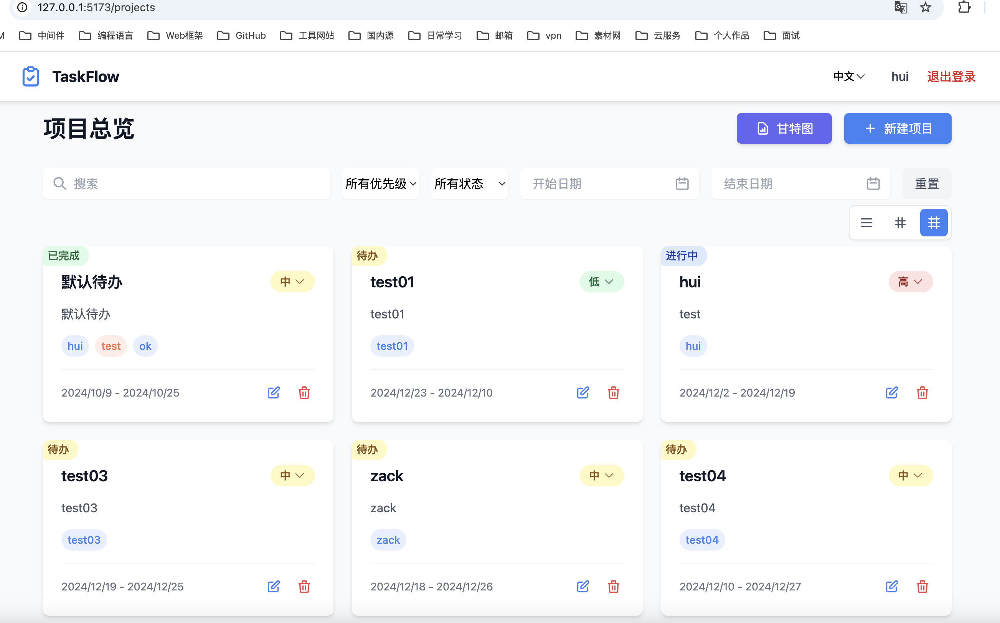

# 任务管理系统
- 前端项目：https://github.com/HuiDBK/TaskFlow-FE
- 后端项目：https://github.com/HuiDBK/TaskFlow
- 在线体验：http://43.138.173.93:6969/

登陆


首页


## 项目简介
> 任务管理系统 是一个基于 FastAPI 构建的 Web 应用程序，提供用户管理、项目管理、任务管理、甘特图预览以及 GitHub 登录等核心功能。项目集成了 [py-tools](https://github.com/HuiDBK/py-tools)，旨在助力快速开发与交付。

> 本项目的核心目标是帮助开发者深入理解并掌握 FastAPI 中的常用功能与最佳实践，包括中间件、自定义错误处理、依赖注入（Depends）、模块化路由等。同时，通过 [py-tools](https://github.com/HuiDBK/py-tools) 的集成与应用，简化业务开发流程，提升开发效率，全面了解其封装与实现细节。


## 项目特色
**1、异步框架服务**

基于 `FastAPI` 和 `Uvicorn` 构建高性能异步服务，`py-tools` 集成封装 `SQLAlchemy、aiohttp、loguru` 等，助力快速开发与交付。

**2、日志链路追踪**

实现完整的日志链路追踪，通过 `FastAPI` 中间件、`contextvars` 与日志过滤器，精确定位请求路径，提升系统可观测性与问题排查效率。

**3、统一错误处理与鉴权** 

封装统一的错误处理机制，支持 `JWT` 与 `OAuth2.0` 鉴权体系，结合 `APIRoute` 实现日志中间件，确保 Web 请求的安全性与一致性。

**4、请求与用户上下文管理**

基于 `FastAPI Depends` 封装请求上下文，通过自定义鉴权中间件加载用户上下文，借助 `contextvars` 在任意位置轻松获取用户信息，实现便捷的上下文传递。

**5、标准化响应格式**

结合 `pydantic` 模型与错误码设计，统一定义接口响应的成功与失败返回格式，提升 API 的可读性与一致性。

**6、第三方登录集成**

支持 `GitHub OAuth 2.0` 登录，便捷接入第三方认证体系，提升用户体验与系统安全性。

**7、前端技术栈**

前端基于 `React + TypeScript + Vite` 构建，提供中英文双语版本，集成甘特图预览等功能。(AI 辅助开发，提升前端交互与展示效果^_^)

**8、容器化部署**

通过 `docker-compose` 编排服务，简化应用部署流程，实现快速上线与环境一致性保障。

## TODO
1. 项目、任务到期提醒
2. 每日AI Task 分析
3. 项目团队协作管理

## 项目工程结构

```python
    |-- TaskFlow
    |-- bin:  快捷可执行命令文件
    |-- conf:  项目部署中间件的配置
    |-- docs:  项目文档
    |-- logs:  项目日志
    |-- src:   源代码
         |-- data_models:  数据模型
             |-- api_models:       接口出入参校验模型
             |-- logic_models:     业务数据模型
         |-- constants:    常量模块
         |-- enums:        枚举模块
         |-- dao:          数据访问层，例如mysql
         |-- controllers:  控制层，调用services 
             |-- project:  项目路由处理
             |-- tag:      标签路由处理 
             |-- task:     任务路由处理
             |-- user:     用户路由处理
         |-- middlewares:  中间件层
         |-- routers:      路由层，调用handlers
         |-- services:     逻辑层，业务服务逻辑
             |-- oauth:     鉴权模块 
             |-- user:      用户模块 
             |-- project:   项目模块
             |-- task:      任务模块
             |-- tag:       标签模块
         |-- settings:      项目配置模块
         |-- utils:        常用工具
         |-- server.py:    服务入口
    |-- tests: 单元测试用例
    |-- .pre-commit-config.yaml: 代码格式规范
    |-- docker-compose.yaml: docker-compose 配置
    |-- Dockerfile:          项目 Dockerfile 配置
    |-- requirements.txt     依赖文件
    |-- README.md            项目说明文档
    |-- main.py              项目主入口模块
```

## 依赖安装
```python
pip install -r requirements.txt
```

## 项目启动
修改 `src/settings` 目录下的配置文件，如MySQL、Github OAuth等。
```python
python main.py
```

## 项目部署
1. 修改 `src/settings` 目录下的配置文件，如MySQL、Github OAuth等。
2. 把打包好的前端代码放到 `res/front_dist` 目录下。
3. 在当前目录下构建后端服务镜像 `docker build -t taskflow_image .`
4. 运行`./bin/start.sh` 利用 `docker-compose` 编排启动服务。